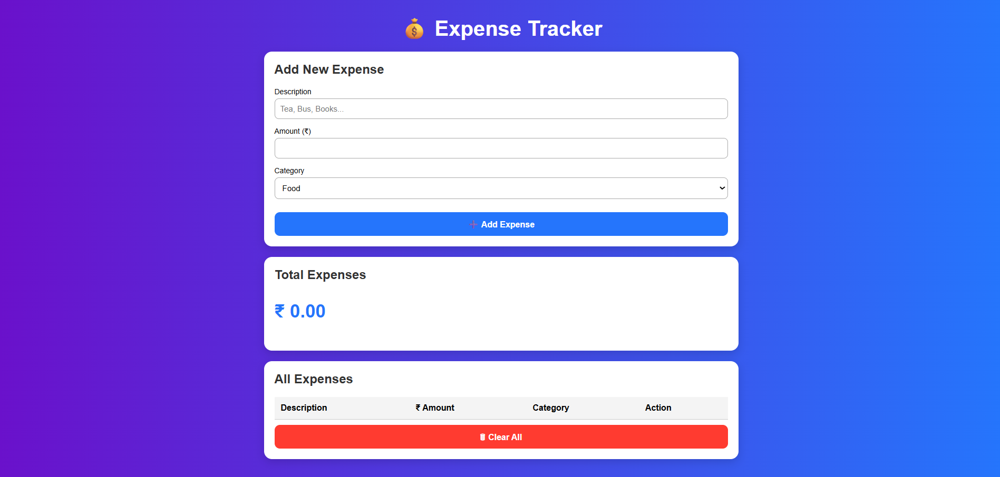

# 🌟 Expense Tracker GUI

A simple and modern **Expense Tracker application** built using **HTML, CSS, and JavaScript** to help users track and manage daily expenses easily.

  

---

## 📝 Overview

The **Expense Tracker** is a web-based application that allows users to:

- Add daily expenses  
- Categorize spending  
- View total expenses  
- Delete all records  
- Store data in browser using LocalStorage  

It is designed with a clean, responsive, and user-friendly interface.

---

## 🚀 Features

- ➕ Add new expenses with description, amount, and category  
- 📊 Automatically calculates total expenses  
- 🧩 Categories: Food, Travel, Shopping, Bills, Others  
- 🗑 Clear all expenses with one click  
- 💾 Data stored in browser (LocalStorage)  
- 🎨 Clean and modern UI design  

---

## 💻 Tech Stack

- HTML  
- CSS  
- JavaScript  

---

## 🏗 Project Structure

ExpenseTracker-GUI/
├── index.html
├── style.css
├── script.js
├── ExpenseTracker.java
├── expense-tracker-ui.png
└── README.md

---

## 🛠 How to Run

### ✅ Method 1: Open in Browser
Just double-click:

index.html

### ✅ Method 2: Live Demo

🔗 https://srichethanapolaki.github.io/ExpenseTracker-GUI/

---

## 📚 Concepts Used

- DOM Manipulation  
- JavaScript Events  
- LocalStorage  
- Responsive UI Design  

---

## 🎯 Future Enhancements

- Add charts and graphs  
- Export report as PDF  
- Add login system  
- Monthly expense summary  

---

## 📝 Author

**Polaki Srichethana**  
Student Developer  
Interested in Web Development and UI Design

---

## ⭐ If you like this project, give it a star ⭐
